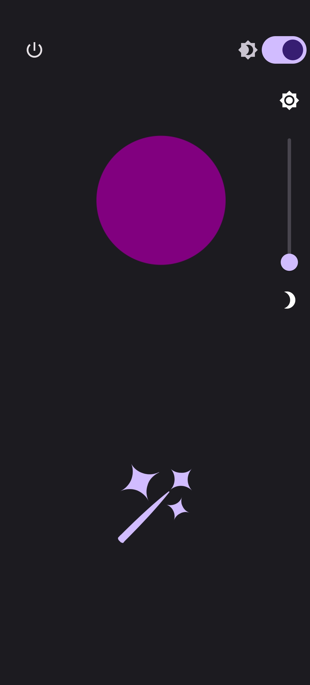
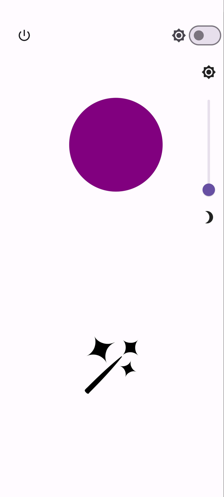

<div style="display: flex; align-items: center;">
  
  <h1 style="margin-left: 10px;">Led-Controller</h1>
</div>

## Overview

Welcome to the Led-Controller project! This project comprises a mobile app built with Flutter and a controller using Arduino and PlatformIO. The main purpose is to control LED strips with a variety of colors and effects. The mobile app offers a user-friendly interface to modify colors and control the LED strip, and the Arduino code leverages the FastLED library for LED programming.

[Watch Video of FireLed](images/fireled.mp4)

[Watch Video of Comet](images/cometled.mp4)

Comet color is modifiable with colorpalette and ok.

## Features

- **Mobile App:**
  - Developed with Flutter.
  - User-friendly interface.
  - Multiple color options for LED strips.
  - Expandable for additional functionalities.

- **Controller (Arduino):**
  - Built with PlatformIO.
  - Utilizes the FastLED library for LED control.
  - Includes various LED effects sourced from the internet.
  - Expandable for custom LED effects.


- **Supported effects currently:**
  - Fire effect.
  - Comet effect.
  - Laser effect.

## Mobile App Screenshots

Here are a few smaller screenshots from the Led-Controller mobile app:

<p float="left">
  
  
</p>

*Screenshot 1: Main color selection screen.*  *Screenshot 2: LED effects selection screen.*


## Getting Started

To replicate this project, you will need a controller with a Wi-Fi chip. The code is flexible and can be adapted for various controllers with minimal modifications.

1. Clone the repository:

    ```bash
    git clone https://github.com/Jallunator/MyLEDControlAPP.git
    ```

2. Follow the setup instructions for both the mobile app (Flutter) and the LED controller (Arduino).

3. Customize the LED effects or add your own to personalize the project.

## Contributions

Feel free to contribute to this project! If you have additional LED effects, features for the mobile app, or any other improvements, please submit a pull request.

## Acknowledgments

Special thanks to the FastLED library and other contributors for making this project possible. The LED effects are sourced from the internet, and credit is given to the original creators.

## License

This project is licensed under the [MIT License](LICENSE).

+ Uncomment the serial loop for debugging, it waits serial connection.

Happy coding! 🚀✨
